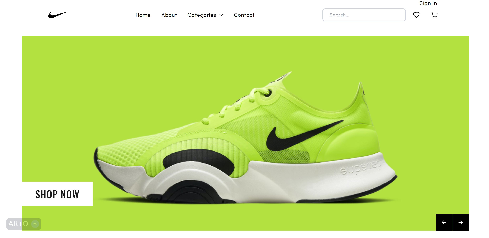

<br />
<br />

<div align="center" id="top">
  

  &#xa0;

  

  <a href="https://jj-ecommerce-store.vercel.app/">Demo</a>
</div>

<h1 align="center">Nike Store</h1>

<p align="center">
  

  

  

  
</p>

<p align="center">
  <a href="#dart-about">About</a> &#xa0; | &#xa0;
  <a href="#sparkles-features">Features</a> &#xa0; | &#xa0;
  <a href="#rocket-technologies">Technologies</a> &#xa0; | &#xa0;
  <a href="#white_check_mark-requirements">Requirements</a> &#xa0; | &#xa0;
  <a href="#checkered_flag-starting">Starting</a> &#xa0; | &#xa0;
  <a href="#memo-license">License</a> &#xa0; | &#xa0;
  <a href="https://github.com/jeffjiang13" target="_blank">Author</a>
</p>

<br>

## :dart: About ##

The Nike Store is a highly responsive e-commerce website designed to elevate your online shopping experience. Specializing in footwear, this platform offers a wide range of Nike shoes, providing detailed descriptions and high-quality images for each product.

An integrated Stripe checkout ensures a secure and streamlined purchase process, enabling you to shop with ease. Our website is designed to adapt seamlessly to different devices, offering an optimal browsing experience regardless of screen size.

Apart from the shopping functionalities, the Nike Store website includes a dedicated contact page, making it easy for you to reach out with any queries. We value your feedback and inquiries, and our support team is committed to providing prompt and efficient assistance.

The about page provides a detailed overview of our store, offering insights into our journey and ethos.

One of the unique features of our store is the Favorites page. Here, you can save your favorite items for future reference. These favorites remain stored even after logging out, ensuring a personalized shopping experience each time you visit.

We also offer an order history page, where you can track past purchases and monitor your spending.

The profile page offers the ability to upload a profile image, adding a personal touch to your shopping journey.

The Nike Store isn't merely a shopping platform – it's a space where quality meets convenience, where style meets simplicity, and where customers are at the heart of every feature. Join us and elevate your shopping experience to new heights!

## :sparkles: Features ##
:heavy_check_mark: Responsive Stripe checkout;\
:heavy_check_mark: Responsive product catalog;\
:heavy_check_mark: Contact page with email address;\
:heavy_check_mark: About page with store information;\
:heavy_check_mark: Favorites page with working favorites still save even after logging out;\
:heavy_check_mark: Order history page;\
:heavy_check_mark: Profile page with ability to handle upload of profile image;

## :rocket: Technologies ##

The following tools were used in this project:

- [Node.js](https://nodejs.org/en/)
- [React](https://reactjs.org/)
- [Next.js](https://nextjs.org/)
- [Strapi Headless CMS](https://strapi.io/)
- [Tailwind CSS](https://tailwindcss.com/)

## :white_check_mark: Requirements ##

Before starting :checkered_flag:, you need to have [Git](https://git-scm.com) and [Node](https://nodejs.org/en/) installed.

## :checkered_flag: Starting ##

```bash
# Clone this project
$ git clone https://github.com/jeffjiang13/ecommerce-store

# Access
$ cd ecommerce

# Install dependencies
$ yarn

# Run the project
$ yarn start

# The server will initialize in the <http://localhost:3000>

```

## :memo: License ##

This project is under license from MIT. For more details, see the [LICENSE](LICENSE.md) file.


Made with :heart: by <a href="https://github.com/jeffjiang13" target="_blank">Jeff Jiang</a>

&#xa0;

<a href="#top">Back to top</a>
<!--  -->
